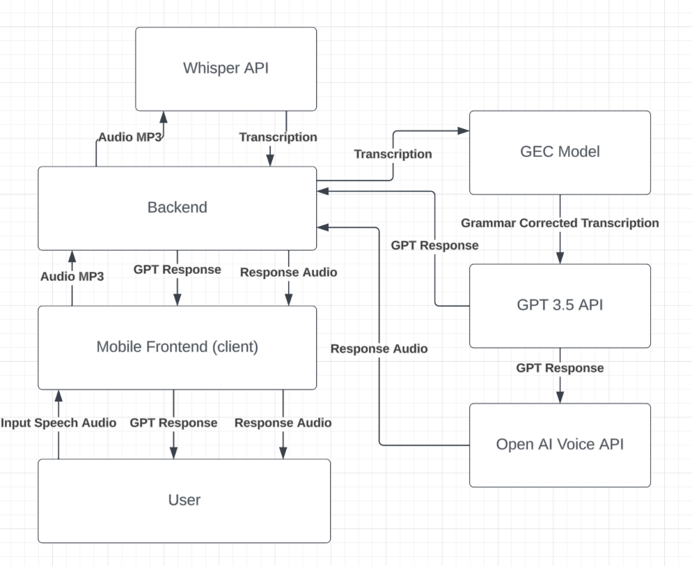
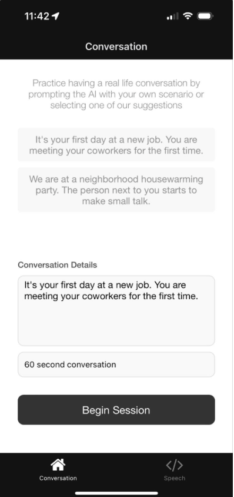

<!-- omit in toc -->
# Parakeet: AI Language Learning

<!-- omit in toc -->
## Table of Contents
- [Introduction](#introduction)
- [Technology](#technology)
- [Running the App](#running-the-app)
- [Screenshots](#screenshots)
- [Extensions](#extensions)


## Introduction
Parakeet is a mobile app designed to help language learners pick up new languages by facilitating conversations with an AI agent.

The app makes use of Generative AI to enable users to hold a simulated conversation in a target language, and then provides users with grammatical feedback and coaching at the end of a conversation session. Users can also play back the corrections that the app offers to listen to how the corrected sentences should sound.

The app currently supports learning for the English language.

## Technology
Parakeet leverages a custom-built and trained [T5 Transformer](https://huggingface.co/docs/transformers/en/model_doc/t5) model to provide grammatical improvements and coaching to speakers as they converse with the app. The model was fine-tuned on the synthetic [C4_200M](https://github.com/google-research-datasets/C4_200M-synthetic-dataset-for-grammatical-error-correction) dataset for Grammar Error Correction.

An encoder-decoder model was chosen for this task to provide maximum attention to the users' input, as the model takes in the user's conversation responses as input, and outputs an "optimal" dialogue.

The app makes use of the OpenAI Whisper, GPT-3.5, and Voice APIs for Speech to Text, Response Generation, and Text to Speech, respectively.

The entire application stack is visualized via the following diagram:


## Running the App
To train the model, begin by downloading the [C4_200M](https://github.com/google-research-datasets/C4_200M-synthetic-dataset-for-grammatical-error-correction) dataset as described in the linked repository (the dataset takes roughly 50GB of space).

Next, run the `ml/grammar_error_correction.ipynb` notebook to preprocess data and train the model (a checkpoint is not currently provided due to the size of the model). A parallelized grid search for tuning parameters is implemented in `ml/grammar_hyperparam_tuning.ipynb`. Your trained model can then be evaluated with `grammar_model_evaluation.ipynb`.

Once your model is trained, create a directory called `models`, and store your checkpoint there.

Duplicate `backend/.envtemplate`, rename it to `backend/.env` and add your Open AI API key to the file.

Next, create and activate virtual environment as follows:
```bash
python3 -m venv env
source env/bin/activate
pip install -r requirements.txt
```

You can now run the backend via:
```bash
python main.py
```

Now that the server is running, either disable your local machine's firewall or utilize [ngrok](https://ngrok.com) to generate a server URL, which you can then place in `mobile/constants.ts`

Now, to install mobile dependencies, make sure you have [yarn](https://yarnpkg.com) installed, and then run:
```bash
cd mobile
yarn install
```

You can then begin running the app via:
```bash
yarn start
```
or
```bash
npx expo start
```


The Expo dev server should begin running locally, and you should be able to download the Expo Go application and begin running parakeet!

## Screenshots
| Session Start | Practice Session |
|---|---|
|   |    |

## Extensions

Parakeet can easily be extended, and new features may be added in the future, including: 
- Providing feedback on a broader range of topics, such as accent and/or diction of the user
- Extending the app to languages beyond English
- The ability to "chain" multiple sessions to form a cohesive relationship with the AI agent
